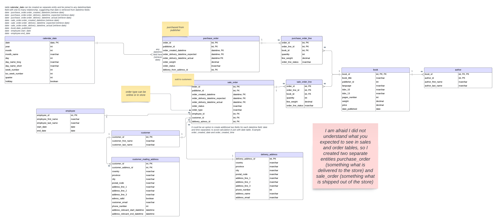
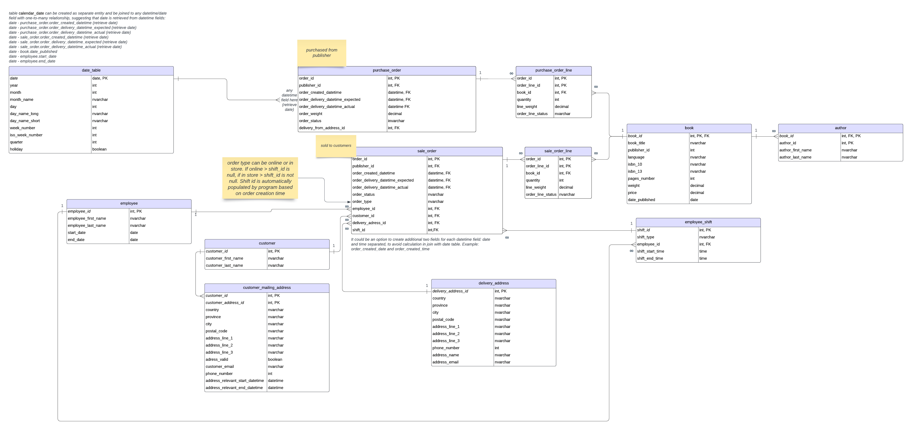

# Assignment 2: Design a Logical Model and Advanced SQL

🚨 **Please review our [Assignment Submission Guide](https://github.com/UofT-DSI/onboarding/blob/main/onboarding_documents/submissions.md)** 🚨 for detailed instructions on how to format, branch, and submit your work. Following these guidelines is crucial for your submissions to be evaluated correctly.

#### Submission Parameters:
* Submission Due Date: `December 22, 2024`
* Weight: 70% of total grade
* The branch name for your repo should be: `assignment-two`
* What to submit for this assignment:
    * This markdown (Assignment2.md) with written responses in Section 1
    * Two Entity-Relationship Diagrams (preferably in a pdf, jpeg, png format).
    * One .sql file 
* What the pull request link should look like for this assignment: `https://github.com/<your_github_username>/sql/pulls/<pr_id>`
    * Open a private window in your browser. Copy and paste the link to your pull request into the address bar. Make sure you can see your pull request properly. This helps the technical facilitator and learning support staff review your submission easily.

Checklist:
- [ ] Create a branch called `assignment-two`.
- [ ] Ensure that the repository is public.
- [ ] Review [the PR description guidelines](https://github.com/UofT-DSI/onboarding/blob/main/onboarding_documents/submissions.md#guidelines-for-pull-request-descriptions) and adhere to them.
- [ ] Verify that the link is accessible in a private browser window.

If you encounter any difficulties or have questions, please don't hesitate to reach out to our team via our Slack at `#cohort-5-help`. Our Technical Facilitators and Learning Support staff are here to help you navigate any challenges.

***

## Section 1:
You can start this section following *session 1*, but you may want to wait until you feel comfortable wtih basic SQL query writing. 

Steps to complete this part of the assignment:
- Design a logical data model
- Duplicate the logical data model and add another table to it following the instructions
- Write, within this markdown file, an answer to Prompt 3


###  Design a Logical Model

#### Prompt 1
Design a logical model for a small bookstore. 📚

At the minimum it should have employee, order, sales, customer, and book entities (tables). Determine sensible column and table design based on what you know about these concepts. Keep it simple, but work out sensible relationships to keep tables reasonably sized. 

Additionally, include a date table. 

There are several tools online you can use, I'd recommend [Draw.io](https://www.drawio.com/) or [LucidChart](https://www.lucidchart.com/pages/).

**HINT:** You do not need to create any data for this prompt. This is a conceptual model only. 

#### Prompt 2
We want to create employee shifts, splitting up the day into morning and evening. Add this to the ERD.

#### Prompt 3
The store wants to keep customer addresses. Propose two architectures for the CUSTOMER_ADDRESS table, one that will retain changes, and another that will overwrite. Which is type 1, which is type 2? 

**HINT:** search type 1 vs type 2 slowly changing dimensions. 

```
If customer address is overwritten every time when customer changes his/her address, customer_address table is type 1.
It means that one customer_id corresponds to one address_id. 
Type 2 is another way to create CUSTOMER_ADDRESS table: 
keep all customer addresses and every time when address is changed, new row with customer address is added and two date columns are populated: 
start_date (when record was inserted in table) and end_date (null for actual address, non-null for old historical addresses, date when address stopped being actual). Flag column can be added (whether address is actual): if end_date is null then True, otherwise it is False (or we can use only date columns). In this scenario one customer_id corresponding to multiple address_id, with only one address_id being actual and the rest are historical addresses. 
```

***

## Section 2:
You can start this section following *session 4*.

Steps to complete this part of the assignment:
- Open the assignment2.sql file in DB Browser for SQLite:
	- from [Github](./02_activities/assignments/assignment2.sql)
	- or, from your local forked repository  
- Complete each question


### Write SQL

#### COALESCE
1. Our favourite manager wants a detailed long list of products, but is afraid of tables! We tell them, no problem! We can produce a list with all of the appropriate details. 

Using the following syntax you create our super cool and not at all needy manager a list:
```
SELECT 
product_name || ', ' || product_size|| ' (' || product_qty_type || ')'
FROM product
```

But wait! The product table has some bad data (a few NULL values). 
Find the NULLs and then using COALESCE, replace the NULL with a blank for the first problem, and 'unit' for the second problem. 

**HINT**: keep the syntax the same, but edited the correct components with the string. The `||` values concatenate the columns into strings. Edit the appropriate columns -- you're making two edits -- and the NULL rows will be fixed. All the other rows will remain the same.

<div align="center">-</div>

```
SELECT 
product_name || ', ' || coalesce(product_size,'') || ' (' || coalesce(product_qty_type,'unit') || ')' as summary
FROM product
```

#### Windowed Functions
1. Write a query that selects from the customer_purchases table and numbers each customer’s visits to the farmer’s market (labeling each market date with a different number). Each customer’s first visit is labeled 1, second visit is labeled 2, etc. 

You can either display all rows in the customer_purchases table, with the counter changing on each new market date for each customer, or select only the unique market dates per customer (without purchase details) and number those visits. 

**HINT**: One of these approaches uses ROW_NUMBER() and one uses DENSE_RANK().

```
select distinct customer_id
		, market_date
		, dense_rank() OVER (PARTITION BY customer_id ORDER BY market_date) as visit_number
from customer_purchases
order by customer_id
```

2. Reverse the numbering of the query from a part so each customer’s most recent visit is labeled 1, then write another query that uses this one as a subquery (or temp table) and filters the results to only the customer’s most recent visit.

```
select x.customer_id
	, x.market_date as most_recent_visit
from(
select distinct customer_id
		, market_date
		, dense_rank() OVER (PARTITION BY customer_id ORDER BY market_date DESC) as visit_number
from customer_purchases
order by customer_id
) x
where x.visit_number = 1 
```

3. Using a COUNT() window function, include a value along with each row of the customer_purchases table that indicates how many different times that customer has purchased that product_id.

<div align="center">-</div>

```
-- I am sorry I am missing something here: It is not clear for me whether this task related to the previous tasks... 

-- If no, we can proceed like this 

select *
	, count(product_id) over (partition by customer_id, product_id order by customer_id, product_id) as total_times_product_id_purchased_by_customer
	, count(product_id) over (partition by customer_id, product_id, market_date order by customer_id, product_id, market_date) as total_times_product_id_purchased_by_customer_during_visit
from customer_purchases

-- If task is related to the previous tasks: 

-- Times the product was purchased during the most recent visit: 
select x.customer_id
	, x.market_date as most_recent_visit
	, product_id as product_id_purchased_most_recent_visit
	, product_times_purchased_most_recent_visit
from(
select distinct customer_id
		, market_date
		, dense_rank() OVER (PARTITION BY customer_id ORDER BY market_date DESC) as visit_number
		, product_id
		, count() OVER (PARTITION BY customer_id, product_id, market_date ORDER BY product_id, market_date DESC) as product_times_purchased_most_recent_visit
from customer_purchases
order by customer_id
) x
where x.visit_number = 1 

-- If we want to have all times product was purchased and most recent visit date

select cp.customer_id
	  , cp.product_id
	  , count(cp.product_id) as total_times_product_purchased
	  , x.market_date as most_recent_visit
from customer_purchases cp
inner join (select distinct customer_id
		, market_date
		, dense_rank() OVER (PARTITION BY customer_id ORDER BY market_date DESC) as visit_number
		, product_id
from customer_purchases
order by customer_id
) x on 
cp.customer_id = x.customer_id
and x.visit_number = 1
group by cp.customer_id
	  , cp.product_id

 -- if we want to avoid customer id duplication 

select cp.customer_id
		, x.market_date as most_recent_visit
	  , Count(CASE WHEN product_id = 1 THEN cp.product_id END) as total_times_product_1_purchased
	  , Count(CASE WHEN product_id = 2 THEN cp.product_id END) as total_times_product_2_purchased
	  , Count(CASE WHEN product_id = 3 THEN cp.product_id END) as total_times_product_3_purchased
	  , Count(CASE WHEN product_id = 4 THEN cp.product_id END) as total_times_product_4_purchased
	  , Count(CASE WHEN product_id = 5 THEN cp.product_id END) as total_times_product_5_purchased
	  , Count(CASE WHEN product_id = 7 THEN cp.product_id END) as total_times_product_7_purchased
	  , Count(CASE WHEN product_id = 8 THEN cp.product_id END) as total_times_product_8_purchased
	  , Count(CASE WHEN product_id = 16 THEN cp.product_id END) as total_times_product_16_purchased
from customer_purchases cp
inner join (
select distinct customer_id
		, market_date
		, dense_rank() OVER (PARTITION BY customer_id ORDER BY market_date DESC) as visit_number
from customer_purchases
order by customer_id
) x on cp.customer_id = x.customer_id
and x.visit_number = 1
group by cp.customer_id
```


#### String manipulations
1. Some product names in the product table have descriptions like "Jar" or "Organic". These are separated from the product name with a hyphen. Create a column using SUBSTR (and a couple of other commands) that captures these, but is otherwise NULL. Remove any trailing or leading whitespaces. Don't just use a case statement for each product! 

| product_name               | description |
|----------------------------|-------------|
| Habanero Peppers - Organic | Organic     |

**HINT**: you might need to use INSTR(product_name,'-') to find the hyphens. INSTR will help split the column. 

<div align="center">-</div>

```
select *
	, CASE WHEN INSTR(product_name,'-') = 0 THEN NULL 
	ELSE trim((SUBSTR(product_name, INSTR(product_name,'-')+1, length(product_name) - INSTR(product_name,'-')))) 
	END 
	as product_description
from product
```

/* 2. Filter the query to show any product_size value that contain a number with REGEXP. */

```
select *
	, CASE WHEN INSTR(product_name,'-') = 0 THEN NULL 
	ELSE trim((SUBSTR(product_name, INSTR(product_name,'-')+1, length(product_name) - INSTR(product_name,'-')))) 
	END 
	as product_description
from product
where product_size regexp '[0-9]'

-- it seems that this solution also works
select *
	, CASE WHEN INSTR(product_name,'-') = 0 THEN NULL 
	ELSE trim((SUBSTR(product_name, INSTR(product_name,'-')+1, length(product_name) - INSTR(product_name,'-')))) 
	END 
	as product_description
from product
where product_size regexp '\d'
```

#### UNION
1. Using a UNION, write a query that displays the market dates with the highest and lowest total sales.

**HINT**: There are a possibly a few ways to do this query, but if you're struggling, try the following: 1) Create a CTE/Temp Table to find sales values grouped dates; 2) Create another CTE/Temp table with a rank windowed function on the previous query to create "best day" and "worst day"; 3) Query the second temp table twice, once for the best day, once for the worst day, with a UNION binding them. 
-- 1) Create a CTE/Temp Table to find sales values grouped dates:

```
CREATE TEMP TABLE IF NOT EXISTS temp.sales_total AS 
select 
	market_date
	, sum(cost_to_customer_per_qty*quantity) as total_sales
from customer_purchases
group by market_date;
```

-- 2) Create another CTE/Temp table with a rank windowed function on the previous query to create  "best day" and "worst day"

```
SELECT *
		, rank() OVER (ORDER BY total_sales DESC) rank_desc
		, rank() OVER (ORDER BY total_sales ASC) rank_asc
FROM temp.sales_total
```

-- 3) Query the second temp table twice, once for the best day, once for the worst day,  with a UNION binding them.

```
-- solution 1:
select market_date
		, total_sales
		, CASE WHEN rank_asc = 1 THEN 'worst_day'
		WHEN rank_desc = 1 THEN 'best_day'
		END as day_type
from(
SELECT *
		, rank() OVER (ORDER BY total_sales DESC) rank_desc
		, rank() OVER (ORDER BY total_sales ASC) rank_asc
FROM temp.sales_total) x
where x.rank_desc = 1 or x.rank_asc = 1

-- solution 2
select market_date
		, total_sales
		, day_type
from(
SELECT *
		, rank() OVER (ORDER BY total_sales DESC) rank
		, 'best_day' as day_type
FROM temp.sales_total
UNION ALL
SELECT *
		, rank() OVER (ORDER BY total_sales ASC) rank
		, 'worst_day' as day_type
FROM temp.sales_total) x
where x.rank = 1
***
```

## Section 3:
You can start this section following *session 5*.

Steps to complete this part of the assignment:
- Open the assignment2.sql file in DB Browser for SQLite:
	- from [Github](./02_activities/assignments/assignment2.sql)
	- or, from your local forked repository  
- Complete each question

### Write SQL

#### Cross Join
1. Suppose every vendor in the `vendor_inventory` table had 5 of each of their products to sell to **every** customer on record. How much money would each vendor make per product? Show this by vendor_name and product name, rather than using the IDs.

**HINT**: Be sure you select only relevant columns and rows. Remember, CROSS JOIN will explode your table rows, so CROSS JOIN should likely be a subquery. Think a bit about the row counts: how many distinct vendors, product names are there (x)? How many customers are there (y). Before your final group by you should have the product of those two queries (x\*y). 

<div align="center">-</div>
```
select v.vendor_name
	, p.product_name
	, sum(price_per_5_units) as sales_total_5_units
from 
(select DISTINCT
		vi.vendor_id,
		vi.product_id, 
		vi.original_price, 
		vi.original_price*5 as price_per_5_units,
		c.customer_id
from vendor_inventory vi
cross join customer c) x
inner join product p on x.product_id = p.product_id
inner join vendor v on x.vendor_id = v.vendor_id
group by v.vendor_name
	, p.product_name;
```

#### INSERT
1. Create a new table "product_units". This table will contain only products where the `product_qty_type = 'unit'`. It should use all of the columns from the product table, as well as a new column for the `CURRENT_TIMESTAMP`.  Name the timestamp column `snapshot_timestamp`.

```
CREATE TEMP TABLE IF NOT EXISTS temp.product_units AS 
select * 	
	, strftime('%Y/%m/%d %H:%M:%S','now') as snapshot_timestamp
from product 
where product_qty_type = 'unit';
select * 
from temp.product_units
```

2. Using `INSERT`, add a new row to the product_unit table (with an updated timestamp). This can be any product you desire (e.g. add another record for Apple Pie). 

<div align="center">-</div>
```
INSERT into temp.product_units
VALUES (7,'Apple Pie', '10"',3, 'unit', strftime('%Y/%m/%d %H:%M:%S','now'));
```

#### DELETE 
1. Delete the older record for the whatever product you added.

**HINT**: If you don't specify a WHERE clause, [you are going to have a bad time](https://imgflip.com/i/8iq872).

<div align="center">-</div>

```
delete from temp.product_units
where 1=1
and product_name = 'Apple Pie'
and snapshot_timestamp = '2024/12/22 21:05:23';
```

#### UPDATE
1. We want to add the current_quantity to the product_units table. First, add a new column, `current_quantity` to the table using the following syntax.
```
ALTER TABLE product_units
ADD current_quantity INT;
```

Then, using `UPDATE`, change the current_quantity equal to the **last** `quantity` value from the vendor_inventory details. 

**HINT**: This one is pretty hard. First, determine how to get the "last" quantity per product. Second, coalesce null values to 0 (if you don't have null values, figure out how to rearrange your query so you do.) Third, `SET current_quantity = (...your select statement...)`, remembering that WHERE can only accommodate one column. Finally, make sure you have a WHERE statement to update the right row, you'll need to use `product_units.product_id` to refer to the correct row within the product_units table. When you have all of these components, you can run the update statement.

```
ALTER TABLE product_units
ADD current_quantity INT; 

-- Step 1. Find Last quantity value
CREATE TEMP TABLE IF NOT EXISTS temp.product_info_qty AS 
select p.product_id	
	  ,p.product_name
	  ,p.market_date as max_market_date
	  ,coalesce(vi.quantity,0) as current_qty
from (select *
from product 
cross join (
select max(market_date) market_date
from vendor_inventory)) p
left join vendor_inventory vi on p.product_id = vi.product_id 
							 and p.market_date = vi.market_date; 
						 
-- Step 2. Update table
						 
Update product_units
set current_quantity = (select current_qty from product_info_qty where product_units.product_id = product_info_qty.product_id); 
	 
select * 
from product_units
```
